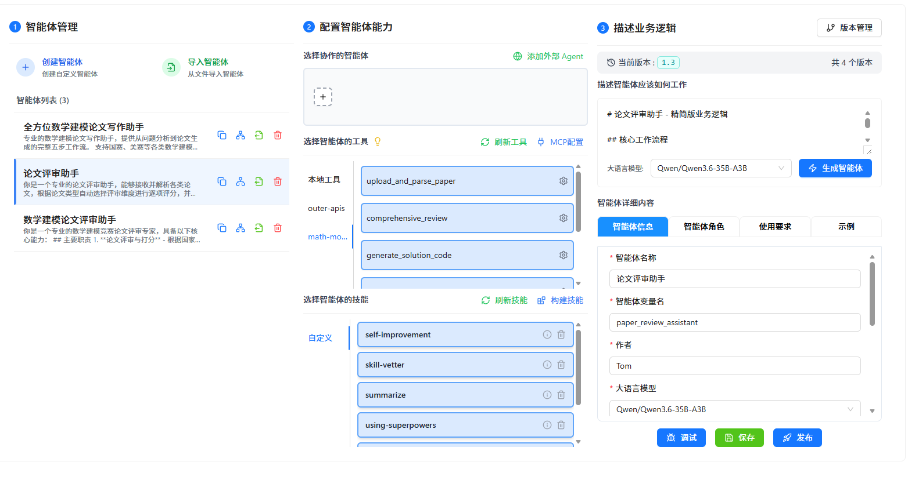
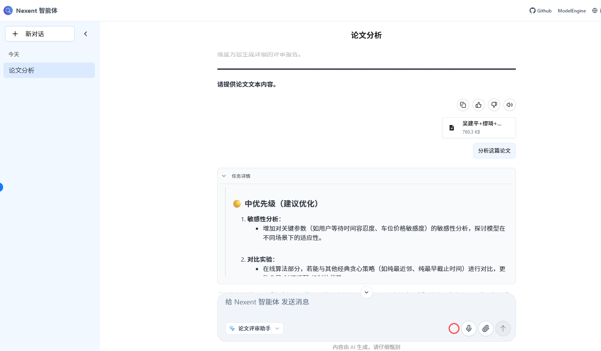
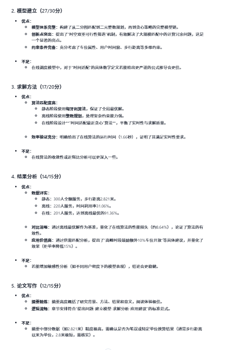
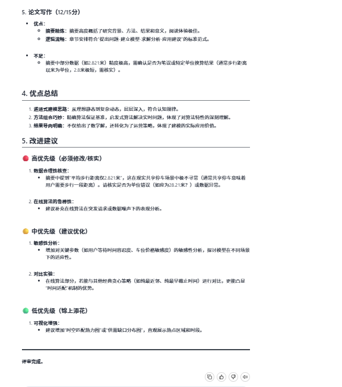

# 重庆大学AI训练营+20240962+论文评审助手智能体

> 基于 **Nexent 零代码平台 + FastMCP** 的专业论文多维度评审智能体，覆盖 4 种论文类型、6 个 MCP 工具，一键生成 Word 评审报告。

> 🔗 **项目仓库**：[https://github.com/Tomlegend2026/mathmodel-paper-workshop](https://github.com/Tomlegend2026/mathmodel-paper-workshop)
>
> 📥 **一键下载智能体配置**：[paper_review_assistant.json](https://github.com/Tomlegend2026/mathmodel-paper-workshop/raw/main/nexent/paper_review_assistant.json)（右键另存为 / 点击下载）

---

## 它解决什么问题？

写论文容易，但**知道自己论文写得怎么样**很难。数模竞赛、学术投稿、学位答辩前，大多数同学只能靠"感觉"和"同学互评"来判断论文质量，缺乏系统、专业、可量化的反馈。

这个智能体在 **Nexent** 上跑起来后，你只需要把论文丢进去，它就能：
- 自动识别论文类型（数模/学术/学位/课程），**套用对应的专业评审标准**
- 按 5 个维度逐项加权打分，**给出总分和等级**
- 指出每个维度的优点和不足，**附具体改进建议**
- **一键生成 Word 格式评审报告**，可直接打印或提交

---

## Nexent + MCP 架构

Nexent 负责"思考和编排"，本地 MCP Server 负责"执行和解析"。

```
┌──────────────────────────────────────────────────────┐
│                   Nexent 平台（推理面）                 │
│                                                      │
│  ┌─────────────┐  ┌──────────────┐  ┌─────────────┐ │
│  │ Qwen3.6 模型 │  │ 智能体编排    │  │ 对话交互     │ │
│  │ 论文分析     │  │ 工具调度      │  │ 结果呈现     │ │
│  │ 评审逻辑     │  │ 流程控制      │  │ 报告输出     │ │
│  └──────┬──────┘  └──────┬───────┘  └──────┬──────┘ │
│         └────────────────┼─────────────────┘         │
└──────────────────────────┼───────────────────────────┘
                           │ SSE 协议 (局域网 IP)
┌──────────────────────────┼───────────────────────────┐
│             本地 MCP Server（执行面）                   │
│                                                      │
│  ┌───────────┐ ┌──────────┐ ┌──────────┐           │
│  │ PDF解析    │ │ DOCX解析  │ │ TXT解析   │  文档解析  │
│  │ PyPDF2    │ │python-docx│ │ 内置     │           │
│  └───────────┘ └──────────┘ └──────────┘           │
│  ┌──────────────────────────────────────┐           │
│  │      论文类型识别 + 加权评分引擎      │  评审核心  │
│  └──────────────────────────────────────┘           │
│  ┌──────────────┐ ┌──────────────────┐             │
│  │ DOCX报告生成  │ │  代码生成模块     │  输出层    │
│  │ python-docx  │ │ Python/MATLAB    │             │
│  └──────────────┘ └──────────────────┘             │
│                                                      │
│  ┌──────────────────────────────────────┐           │
│  │  SiliconFlow API (LLM 调用)           │  云服务    │
│  │  Qwen/Qwen2.5-VL-72B-Instruct        │           │
│  └──────────────────────────────────────┘           │
└──────────────────────────────────────────────────────┘
```

### 架构说明

- **Nexent** 运行 Qwen3.6-35B 模型进行智能编排——理解用户意图、判断论文类型、编排 MCP 工具调用流程
- **本地 MCP Server** 负责文件 I/O 密集型操作——PDF/DOCX 解析、Word 报告生成
- **SiliconFlow API** 被 MCP Server 调用来执行 LLM 评分任务——调用 Qwen2.5-VL-72B 进行逐维度评审打分
- **论文文件在本地解析**，原始文档不会上传到云端

---

## 在 Nexent 上的配置步骤

### 前置要求

- Python 3.10+
- 可访问 SiliconFlow API 的网络环境
- Nexent 平台账号（本地或云端部署均可）

### 第一步：配置环境变量

在项目根目录创建 `.env` 文件：

```bash
# .env 文件内容
SILICONFLOW_API_KEY=sk-xxxxxxxxxxxxxxxxxxxxxxxx
LLM_MODEL=Qwen/Qwen2.5-VL-72B-Instruct
LLM_BASE_URL=https://api.siliconflow.cn/v1
```

> 将 `sk-xxxxxxxx` 替换为你的 SiliconFlow API Key（可在 https://siliconflow.cn 获取）。

### 第二步：安装依赖并启动 MCP 服务器

```bash
cd mathmodel-paper-workshop
pip install fastmcp uvicorn python-docx PyPDF2 requests pyyaml
python mcp_server.py
```

看到以下输出即为启动成功：

```
============================================================
数学建模论文全方位评审助手 - MCP Server
============================================================
API Key: 已配置
LLM Model: Qwen/Qwen2.5-VL-72B-Instruct
LLM Base URL: https://api.siliconflow.cn/v1
============================================================
INFO:     Uvicorn running on http://0.0.0.0:8004 (Press CTRL+C to quit)
```

> 也可双击运行 `start_mcp_http.bat` 一键启动。

### 第三步：在 Nexent 中连接 MCP

1. 打开 Nexent → 进入智能体编辑页面
2. 点击「工具」→「添加 MCP 服务器」
3. **服务器名称**：`math-modeling-paper-`
4. 选择 **SSE 协议**，填入 `http://<你的局域网IP>:8004/sse`
   - 例如：`http://192.168.2.1:8004/sse`
   - 查看本机 IP：在命令行运行 `ipconfig | findstr "IPv4"`
5. 点击「连通性校验」，看到 ✅ 即连接成功

> **关键提示**：Nexent 在本地运行时，**不能使用 `localhost`**。因为 `localhost` 在 Nexent 的容器/进程中指向它自己，而非你的 MCP 服务器。必须使用局域网 IP 地址。

### 第四步：导入智能体配置

1. Nexent 智能体编辑页 → 导入配置
2. 选择 `nexent/paper_review_assistant.json`（或从上方 🔗 项目仓库下载）
3. 导入后，智能体的提示词、四种论文类型的评审标准、6 个 MCP 工具绑定全部就位

### 第五步：开始评审

在 Nexent 对话框里说：

```
请帮我评审这篇数学建模论文
```

然后把论文文件（.docx / .pdf）上传给它，智能体会自动调用 MCP 工具解析论文、按类型评分、生成报告。

---

## 6 个 MCP 工具

所有工具通过 Nexent 平台的 MCP 机制以 SSE 协议调用：

| 工具 | 功能 | 执行位置 |
|------|------|----------|
| `upload_and_parse_paper` | 解析 PDF/DOCX/TXT 论文，提取全文和元数据 | 本地 Python |
| `comprehensive_review` | 按论文类型执行加权多维度评审，返回总分和等级 | MCP Server + SiliconFlow LLM |
| `generate_solution_code` | 根据问题描述生成 Python/MATLAB 求解代码 | MCP Server + SiliconFlow LLM |
| `generate_visualization_code` | 生成数据可视化代码（折线/散点/柱状/饼图/热力图/3D） | MCP Server + SiliconFlow LLM |
| `suggest_structure_optimization` | 分析论文结构完整性并给出优化建议 | MCP Server + SiliconFlow LLM |
| `generate_review_report_docx` | 生成格式规范的 Word 评审报告（含评分表格） | 本地 python-docx |

### 调用流程

```
用户上传论文文件
    │
    ▼
upload_and_parse_paper(file_path, paper_type)  ──→  返回 paper_id + 全文预览
    │
    ▼
comprehensive_review(paper_id, paper_type)    ──→  返回各维度评分 + 总分 + 等级
    │
    ├──→ suggest_structure_optimization(paper_id)   ──→  结构分析与优化建议
    ├──→ generate_solution_code(problem, algorithm)  ──→  Python/MATLAB 代码
    ├──→ generate_visualization_code(data, chart)    ──→  可视化代码
    │
    ▼
generate_review_report_docx(paper_id)          ──→  评审报告.docx 文件
```

### 四种论文类型的差异化评审标准

MCP Server 内置了 `REVIEW_CONFIGS`，为每种论文类型配置了不同的评审维度和分值权重：

| 论文类型 | `paper_type` 参数 | 评审维度 | 满分 |
|---------|------------------|---------|------|
| 数学建模论文 | `math_modeling` | 问题分析 → 模型建立 → 求解方法 → 结果分析 → 论文写作 | 100 (20+30+20+15+15) |
| 学术论文 | `academic` | 创新性 → 方法论 → 实验与结果 → 文献综述 → 写作质量 | 100 (25+25+20+15+15) |
| 学位论文 | `thesis` | 研究意义 → 文献综述 → 研究方法 → 研究结果 → 论文规范 | 100 (15+20+20+25+20) |
| 课程论文 | `course` | 问题理解 → 内容质量 → 分析能力 → 结构组织 → 格式规范 | 100 (20+30+20+15+15) |

**等级划分**：优秀（≥90）、良好（80-89）、中等（70-79）、及格（60-69）、不及格（<60）

---

## 效果展示

以下是在 Nexent 平台上的实际运行截图：



*Nexent 中配置 MCP 服务器连接*


*MCP 工具列表与绑定*



*Nexent 对话中完成论文评审*


*多维度详细评分与改进建议*



*结构化改进建议输出*



*生成评审报告后的结果展示*

---

## 项目亮点

1. **Nexent 原生集成** — 智能体配置、MCP 工具绑定全部在 JSON 中，一键导入即刻可用
2. **四类论文自适应** — 自动识别类型，MCP Server 内置四套独立的评审维度和加权分值
3. **加权评分引擎** — 不同论文类型使用不同维度权重（如数模论文"模型建立"占30分，学位论文"研究结果"占25分）
4. **Word 报告一键导出** — python-docx 本地生成含评分表格、详细评语、改进建议的正式报告
5. **代码生成加持** — 数模论文可额外获得 Python/MATLAB 实现代码和可视化建议
6. **论文文件本地处理** — PDF/DOCX 解析和 Word 生成均在本地 Python 环境完成，原始文件不离开用户电脑

---

## 技术栈

| 层级 | 技术 | 说明 |
|------|------|------|
| 智能体平台 | Nexent | Qwen3.6-35B-A3B，对话管理，MCP 工具编排 |
| MCP 框架 | FastMCP (Python) | SSE 传输协议，工具注册与远程调用 |
| 文档解析 | PyPDF2 / python-docx | PDF 和 DOCX 文本提取 |
| 报告生成 | python-docx | Word 文档创建、表格、格式化 |
| LLM 评分 | SiliconFlow API | Qwen2.5-VL-72B-Instruct，逐维度语义评审 |
| 配置管理 | .env + PyYAML | API Key 和模型参数管理 |

---

## 常见问题排查

**Q: Nexent 连不上 MCP 服务器？**
A: 检查两点：
1. 确认使用**局域网 IP** 而非 `localhost`（如 `http://192.168.2.1:8004/sse`）
2. 确认 MCP 服务器正在运行（终端应显示 `Uvicorn running on http://0.0.0.0:8004`）

**Q: 文件上传后解析失败（"文件不存在"）？**
A: 可能原因：
1. SiliconFlow API Key 未配置或已过期 — 检查 `.env` 文件
2. 依赖未完整安装 — 运行 `pip install fastmcp uvicorn python-docx PyPDF2 requests pyyaml`
3. Nexent 发出的文件 URL 是其内部 MinIO 地址 — 确保 MinIO 的 9000 端口在宿主机可访问

**Q: 评审结果是英文？**
A: 所有 LLM 提示词已使用中文编写。如出现英文，检查 `.env` 中的 `LLM_MODEL` 配置。

**Q: 如何验证 MCP 服务器是否正常？**
A: 运行 `python test_mcp_server.py` 进行功能验证，检查 PDF/Word 解析和模块导入。

---

## 项目文件结构

```
mathmodel-paper-workshop/
├── mcp_server.py              # MCP 服务器主程序（FastMCP，6个工具）
├── test_mcp_server.py         # 功能测试脚本
├── start_mcp_http.bat         # Windows 一键启动（SSE 模式）
├── start_mcp.bat              # 带测试的启动脚本
├── .env                       # 环境变量（API Key、模型配置）
├── nexent/
│   ├── paper_review_assistant.json  # Nexent 智能体配置（可一键导入）
│   ├── 核心配置.png                  # MCP 连接配置截图
│   ├── MCP配置.png                   # 工具绑定截图
│   └── 报告生成示例1-4.png           # 效果展示截图
├── backend/                   # Web 应用后端（FastAPI，可选）
├── frontend/                  # Web 应用前端（React + Vite，可选）
└── docs/                      # 补充说明文档
```

---

## 项目资源

| 资源 | 链接 |
|------|------|
| 📦 **GitHub 仓库** | [Tomlegend2026/mathmodel-paper-workshop](https://github.com/Tomlegend2026/mathmodel-paper-workshop) |
| 📥 **智能体配置文件** | [paper_review_assistant.json](https://github.com/Tomlegend2026/mathmodel-paper-workshop/raw/main/nexent/paper_review_assistant.json)（点击下载） |

> 导入方式：Nexent 智能体编辑页 → 导入配置 → 选择下载的 JSON 文件。

---

**作者**：Tom | **学号**：20240962 | **日期**：2026-05-28
